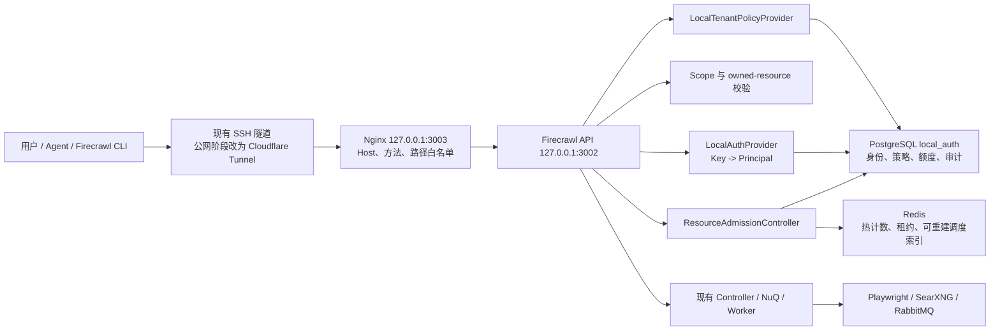

# 京东云 Firecrawl 多用户注册与本地 AuthProvider 技术方案

> 文档状态：已选技术路线与开发设计，尚未实施、部署或通过运行验收
>
> 决策日期：2026-08-09
>
> 源码审计基线：
>
> - 当前开发分支：`authprovider`
> - 当前分支提交：`134117b888f11644231061158a19288f37f757c0`
> - 已合入的最新上游提交：`448ef4bf815d8df798d1a676f0303285e54cabdb`
> - 上游标签：`v2.11.193`
>
> 部署基线：京东云约 2 vCPU、4 GB；Firecrawl `127.0.0.1:3002`；Nginx `127.0.0.1:3003`；本机经 SSH 隧道访问；当前仍为 Nginx 单一共享 Bearer Key。
>
> 重要边界：本文描述目标架构和开发顺序，不代表多用户注册、租户隔离、配额或公网入口已经交付。

## 1. 业务目标与验收边界

本项目下一阶段要把当前“私有入口 + 共享 Key”的 Firecrawl 服务升级为可运营的多用户技术服务。目标用户既包括人员，也包括自动化 Agent 或服务账号。

邀请制 MVP 必须同时具备以下能力：

1. 用户通过本地注册流程建立账号，不依赖 Firecrawl 官方云认证服务；
2. 每个新用户默认获得独立的组织和个人团队，团队是任务隔离与配额归属边界；
3. 用户可以创建、查看、轮换和撤销自己的 API Key，原始 Key 只显示一次；
4. Firecrawl 能把每个有效 Key 解析为稳定的 `user_id`、`team_id`、`org_id` 和 `api_key_id`；
5. A 团队不能查看、取消、追加或订阅 B 团队的任务和结果；
6. 速率、日额度、并发、等待队列和资源用量按团队与 Key 强制执行；
7. 当前单机始终受全局容量阈值保护，单个用户不能耗尽 Playwright、CPU、内存或任务队列；
8. 认证、配额数据库或 Redis 无法确认状态时失败关闭，不能回退到匿名 `bypass`；
9. 审计记录可以定位操作者、团队、Key 和请求，但不记录原始 Key、密码、Authorization、请求正文或敏感 URL 参数；
10. 迁移、备份、恢复和回滚都有可执行验收。

以下情况都不能单独称为多用户交付：

- 只新增注册页面或用户表；
- 只让多个 Key 都能调用 API；
- 只依靠 Nginx 校验不同 Key；
- 只把 `USE_DB_AUTHENTICATION` 改为 `true`；
- 只看到容器 `Up` 或健康接口返回 `200`；
- 只在控制器中携带 `team_id`，却没有跨租户、配额和故障测试。

公开自助注册、Cloudflare 公网入口、付费、高可用和水平扩展属于后续阶段。第一阶段继续使用现有 SSH 隧道完成私有多用户验收。

## 2. 最新源码审计结论

### 2.1 源码具备什么

最新 Firecrawl 已有相当完整的团队级任务归属骨架：

- v1/v2 HTTP 请求经过统一认证中间件后，会把身份写入 `req.auth.team_id` 和 `req.auth.org_id`；
- Crawl 创建时会把 `team_id` 写入 StoredCrawl、队列 group 和 job；
- NuQ PostgreSQL/FDB 队列支持按 `group_id + owner_id` 查询；
- Crawl 状态、取消、WebSocket 等多个入口已有团队所有权检查；
- Redis 限流、队列并发和 team semaphore 有可复用实现；
- Worker 能继续携带 `team_id` 执行并结算任务。

因此，源码并非完全没有多租户基础。其核心隔离粒度已经是 `team_id`，没有必要在外部 Gateway 再维护一套平行的任务所有权账本。

### 2.2 源码不具备什么

当前开源代码不能直接完成京东云本地多用户服务：

- `USE_DB_AUTHENTICATION=false` 时，`authenticateUser()` 通过 `withAuth` 传入固定的 bypass mock，所有调用者仍属于同一团队；`withAuth` 本身只返回调用方提供的 mock；
- 没有完整的本地注册、登录、邮箱验证、密码重置、会话和 API Key 生命周期；
- 当前认证函数直接依赖托管 PostgreSQL RPC `auth_chunk_1`、`auth_chunk_1_from_team`，仓库没有这些 RPC 的 SQL 和完整认证迁移；
- `/admin/integration/*` 只是代理到 `https://integrations.firecrawl.dev`，不是本地注册能力；
- `USE_DB_AUTHENTICATION` 同时控制认证、数据库、日志、账务、自托管判断和部分并发旁路；
- 没有可独立强制的本地日额度和用量账本；Autumn 不可用时部分 credits 检查会放行为 `Infinity`；
- 原生任务所有权覆盖并不均匀，v2 Extract 状态存在已确认的跨团队读取缺口；
- 当前自托管 Compose 不是身份数据的生产持久化与备份方案。

结论是：

> Firecrawl 可以在内部增加本地 AuthProvider，并复用原生 `team_id` 隔离；但 AuthProvider 只解决“你是谁”，还必须同时建设本地策略、额度、资源准入、注册控制面以及遗漏的所有权检查。

### 2.3 必须避免的误改

不能把 `apps/api/src/lib/withAuth.ts` 直接改造成 AuthProvider。该函数还被 billing、notification、team sync 等托管功能使用。

正确切口是：

- 在 `authenticateUser()` 内把“普通 API Key 解析为身份”委托给 AuthProvider；
- 把 `getACUC()` 和 Worker 使用的 `getACUCTeam()` 委托给同一 provider；
- 保留现有 Header/OAuth/MCP 分流、ban 和 Redis 限流等公共编排；Hosted provider 继续保留现有 IP/Key restriction 语义；
- Local MVP 的 hosted `ipRestriction/keyRestriction` flags 固定关闭；如业务需要同类能力，必须由本地 Policy/RestrictionStore 实现，不能访问 hosted `dbRr`；
- 本地 MVP 显式关闭未实现的 OAuth、MCP、Preview 和 Keyless 路径；
- 通过兼容适配器暂时把新 Principal 转为现有 `AuthCreditUsageChunk`，减少首轮改动面。

普通 HTTP、v0 入口和 Crawl WebSocket 都会直接或间接调用 `authenticateUser()`，所以不能只在 Nginx 或 Express 某一组路由上增加认证。

## 3. 架构决策 ADR-001

### 3.1 选定方案

选定以下主链路：

> Firecrawl 内嵌 LocalAuthProvider + LocalTenantPolicyProvider + LocalUsageLedger + ResourceAdmissionController；Nginx 保留为入口、Host/路径白名单和反向代理，不再承担单一共享 Key 校验；第一阶段不独立创建 API Gateway 服务。

### 3.2 方案比较

| 方案 | 优点 | 关键缺点 | 决策 |
| --- | --- | --- | --- |
| Nginx 多 Key | 改动小 | 无用户生命周期、team 上下文、任务归属、原子配额和细粒度审计 | 不采用 |
| 直接打开上游 DB 认证 | 能进入现有认证分支 | 缺少官方 RPC/迁移，并会连带启用 cloud 账务、日志和并发行为 | 不采用 |
| 独立 API Gateway 维护所有权 | 不改 Firecrawl 核心 | 形成双重任务账本，难覆盖 Worker、Redis/GCS 回退和控制器内 WebSocket 鉴权 | 当前不采用 |
| Firecrawl 内嵌本地 Provider | 复用原生 team_id、队列 owner 和任务控制器 | 需要修改核心并补本地配额与所有权缺口 | 采用 |

### 3.3 什么时候才需要独立 Gateway

未来出现以下任一明确需求时，可以重新评估独立 Gateway：

- 同一个入口代理多个不同产品或多个 Firecrawl 集群；
- 公司已有统一 WAF、统一计费、统一开发者平台或统一 API 协议；
- 必须保持 Firecrawl 上游源码零修改；
- 需要跨地域流量调度、协议转换或集中式商业计费。

即使未来增加 Gateway，Firecrawl 内部仍必须验证 `team_id` 和任务所有权。Gateway 不能成为唯一租户隔离边界。

## 4. 目标拓扑与责任边界

### 4.1 数据面



### 4.2 API、Console 与 Admin 三个访问平面

私有验收阶段冻结以下目标监听。它们是待实施配置，不是当前已监听事实；实施前仍要做端口冲突检查：

| 平面 | 本机入口与 SSH 转发目标 | Nginx 允许路由 | 身份与边界 | 公网阶段 |
| --- | --- | --- | --- | --- |
| API | `127.0.0.1:3002 -> jingdong-vps:127.0.0.1:3003`，SSH 内 HTTP | 批准的 `/v2/*`、authenticated probe | Bearer API Key；不使用 cookie | `api.<domain>:443`，经 Cloudflare Tunnel |
| Console | `127.0.0.1:3443 -> jingdong-vps:127.0.0.1:3443`，Nginx TLS | Console 静态资源、`/auth/*` | 用户 session + CSRF；只允许 Console Origin | `console.<domain>:443`，经 Cloudflare Tunnel |
| Admin | `127.0.0.1:3444 -> jingdong-vps:127.0.0.1:3444`，Nginx TLS | `/internal/admin/*` | 独立 platform-admin session、MFA、CSRF；仅 SSH 授权人员 | 永不进入 Cloudflare，不发布公网 DNS |
| Validation（临时） | `127.0.0.1:3445 -> jingdong-vps:127.0.0.1:3445`，Nginx TLS | canary `/auth/*`、`/v2/auth/probe`；维护窗内批准的最小 Scrape/Crawl | 仅独立运维 SSH 账号；外部 API/Console 503 时继续验证 | 切换完成立即关闭，永不公开 |
| Internal health | 京东云 loopback 或 Unix socket，不转发给普通用户 | `/internal/health/live`、`/internal/health/ready` | 运维探针；Nginx 外部 Host deny | 永不公开 |

私有 Console/Admin/Validation 使用项目私有 CA 签发的证书，授权客户端将 `console.firecrawl.internal`、`admin.firecrawl.internal`、`validate.firecrawl.internal` 解析到 `127.0.0.1` 并信任该 CA；因此 session cookie 仍使用 Secure、HttpOnly、SameSite。正式邮箱验证 URL 来自 `LOCAL_AUTH_DISCOVERY_URL=https://console.firecrawl.internal:3443`，用户需要先建立授权 SSH 隧道。切流前的 canary 邮件必须改用单独冻结的 `LOCAL_AUTH_CANARY_DISCOVERY_URL=https://validate.firecrawl.internal:3445`，不能根据请求 Host 动态推导；Validation 关闭后该 URL 立即失效。若不交付这套私有 TLS/解析，不得以 HTTP 临时关闭 Secure cookie，而应暂停浏览器 Console，只保留服务器本地管理命令。

API Bearer 流量由 SSH 加密，仍保持现有本机 `http://127.0.0.1:3002` 客户端习惯。Console 的同源后端代理控制面数据，不要求浏览器跨域调用 API；API 默认不返回浏览器 CORS 许可。公开阶段重新冻结真实域名、证书、Cloudflare Origin 和邮件链接，Admin 平面保持私有。

### 4.3 组件边界

各组件边界如下：

| 组件 | 负责 | 不负责 |
| --- | --- | --- |
| Nginx | 回环监听、TLS 终止或 Tunnel 回源、Host/路径/方法白名单、请求大小、超时、粗粒度防护 | 用户 Key 数据库、任务所有权、业务额度 |
| LocalAuthProvider | 校验 Bearer Key、解析 Principal、检查 Key/用户/团队状态 | 注册 UI、用量结算、任务结果授权 |
| 注册控制面 | 注册、邮箱验证、会话、邀请、API Key 生命周期、管理员操作 | 抓取任务代理 |
| Scope/Owned Resource | 接口 scope 和 `team_id + resource_id` 所有权 | 计算每日额度 |
| LocalTenantPolicyProvider | 返回团队/Key 的速率、并发、请求硬上限和功能策略 | 执行抓取 |
| ResourceAdmissionController | 原子速率检查、额度预占、团队/全局并发和有限等待队列 | 保存用户密码 |
| LocalUsageLedger | 配额窗口、预占、结算、释放、过期回收、对账 | 热路径信号量 |
| Firecrawl Controller/Worker | 任务创建、队列、抓取、状态、结果、取消 | 再建一套用户数据库 |

身份数据可以在现有 PostgreSQL 进程中使用独立 `local_auth` schema 或独立 database 与最小权限账号。当前 4 GB 主机不需要为 AuthProvider 新开一个 PostgreSQL 进程，但身份数据必须有独立迁移、持久卷、备份和恢复生命周期。

## 5. 配置解耦

### 5.1 新配置契约

以下名称作为实现目标；合并代码前应在配置 schema、`.env.example` 和部署文档中一次性冻结：

```text
DEPLOYMENT_MODE=self_hosted|hosted
DEPLOYMENT_PROFILE=upstream_self_hosted|jdcloud_multiuser|hosted
AUTH_REQUIRED=true|false
AUTH_PROVIDER=disabled|local|hosted_postgres
TENANT_POLICY_PROVIDER=local|autumn|none
USAGE_PROVIDER=local|autumn|none
TENANT_LIMITS_ENABLED=true|false
TASK_PERSISTENCE_ENABLED=true|false
GLOBAL_WORKLOAD_LIMIT=<positive integer>
GLOBAL_PENDING_LIMIT=<positive integer>
TEAM_PENDING_LIMIT=<positive integer>
REGISTRATION_MODE=disabled|invite|public
LOCAL_AUTH_DATABASE_URL=<secret reference>
LOCAL_AUTH_HMAC_ACTIVE_VERSION=<version>
LOCAL_AUTH_HMAC_KEYS_FILE=<restricted file>
LOCAL_AUTH_DISCOVERY_URL=<local console URL>
LOCAL_AUTH_CANARY_DISCOVERY_URL=<temporary validation URL>
LOCAL_AUTH_CANARY_ENABLED=false
PROXY_CONFIG_GENERATION=<non-secret generation id>
```

职责必须分开：

- `DEPLOYMENT_MODE` 只表示部署形态；
- `DEPLOYMENT_PROFILE` 标识本项目可执行的配置组合；`jdcloud_multiuser` 是京东云多用户生产的明确标志；
- `AUTH_REQUIRED=true` 要求所有数据面请求必须得到真实 Principal；
- `AUTH_PROVIDER` 只表示认证来源；
- `TENANT_POLICY_PROVIDER` 只表示策略来源；
- `USAGE_PROVIDER` 只表示额度与用量账本；
- `TENANT_LIMITS_ENABLED` 决定是否强制团队策略；京东云多用户生产不允许关闭；
- `TASK_PERSISTENCE_ENABLED` 决定任务状态是否持久化；
- `GLOBAL_WORKLOAD_LIMIT` 是进程/Worker 必须共同遵守的真实工作单元上限，不能由 team 开关关闭；
- `GLOBAL_PENDING_LIMIT` 和 `TEAM_PENDING_LIMIT` 限制持久 waiting backlog；
- `REGISTRATION_MODE` 决定注册入口是否开放；
- `LOCAL_AUTH_CANARY_ENABLED` 只允许在切流前通过临时 Validation loopback 验证本地注册控制面和 auth probe；启用时只接受独立的 `LOCAL_AUTH_CANARY_DISCOVERY_URL`，所有 Firecrawl 数据任务保持关闭，正常生产必须为 `false`。

本地生产多用户的预期组合是：

```text
DEPLOYMENT_MODE=self_hosted
DEPLOYMENT_PROFILE=jdcloud_multiuser
AUTH_REQUIRED=true
AUTH_PROVIDER=local
USE_DB_AUTHENTICATION=false
TENANT_POLICY_PROVIDER=local
USAGE_PROVIDER=local
TENANT_LIMITS_ENABLED=true
TASK_PERSISTENCE_ENABLED=true
GLOBAL_WORKLOAD_LIMIT=1
GLOBAL_PENDING_LIMIT=<finite value>
TEAM_PENDING_LIMIT=<finite value>
REGISTRATION_MODE=invite
LOCAL_AUTH_CANARY_ENABLED=false
PROXY_CONFIG_GENERATION=<deployed generation id>
```

### 5.2 旧配置兼容

兼容期不能一次性改变 `USE_DB_AUTHENTICATION` 的全部语义。当前仍有大量生产调用点把它当作 hosted 数据库、日志、账务、监控和 Worker feature gate；这些调用点要逐个迁移到显式 capability，不能全局替换。

Provider 与部署形态的兼容规则是：

- 未配置 `AUTH_PROVIDER` 且 `USE_DB_AUTHENTICATION=true`：映射为 `hosted_postgres`；
- 未配置 `AUTH_PROVIDER` 且 `USE_DB_AUTHENTICATION!=true`：映射为 `disabled`，保持现有上游自托管行为；
- 显式 `AUTH_PROVIDER=local`：不允许再由 `USE_DB_AUTHENTICATION` 推导部署形态或绕过团队限制；
- 已配置 `DEPLOYMENT_MODE`：`isSelfHosted()` 读取显式值；
- 未配置 `DEPLOYMENT_MODE`：兼容期继续按现有 `USE_DB_AUTHENTICATION !== true` 推导，避免破坏上游 hosted 部署。

兼容映射只服务上游默认行为。京东云 local 生产配置显式保持 `USE_DB_AUTHENTICATION=false` 以关闭 hosted RPC/账务路径，并写出全部 provider 与 `DEPLOYMENT_MODE=self_hosted`；本地认证与任务持久化使用新的独立 capability，不能再次经过 `withAuth` bypass。`USE_DB_AUTHENTICATION` 在相关 hosted feature 调用点完成迁移前仍保留原作用。

### 5.3 启动时失败关闭

下列情况必须拒绝启动或返回健康检查失败，不能自动退回 `disabled/bypass`：

- 多用户模式选择 `AUTH_PROVIDER=disabled`；
- `DEPLOYMENT_PROFILE=jdcloud_multiuser` 但 `AUTH_REQUIRED!=true`；
- `DEPLOYMENT_PROFILE=jdcloud_multiuser` 但 `LOCAL_AUTH_CANARY_ENABLED=true`；
- `AUTH_PROVIDER=local` 但数据库、迁移版本或 HMAC 主密钥缺失；
- `AUTH_PROVIDER=local` 但 `TENANT_LIMITS_ENABLED=false` 或 `TASK_PERSISTENCE_ENABLED=false`；
- `GLOBAL_WORKLOAD_LIMIT`、`GLOBAL_PENDING_LIMIT` 或 `TEAM_PENDING_LIMIT` 缺失、非正数，或 `TEAM_PENDING_LIMIT >= GLOBAL_PENDING_LIMIT`；单一 team 必须给其他 team 留出全局 pending 空间；
- local auth 与 hosted RPC 同时被选中；
- `TENANT_LIMITS_ENABLED=true` 但策略或 usage provider 为 `none`；
- 注册已开放但密码哈希、邮箱、Token HMAC 或 session 配置不完整；
- canary 已开启但临时 discovery URL 缺失、不是固定 Validation Origin，或与正式 Console URL 相同；
- 数据库 schema 版本低于应用要求；
- Nginx 注入的配置 generation 与应用 `PROXY_CONFIG_GENERATION` 不一致。

应用不能靠猜测判断 Nginx 是否已经切换。Nginx 必须覆盖外部同名 Header，并为数据面和控制面请求注入非敏感 `X-Internal-Config-Generation`；应用只接受与 `PROXY_CONFIG_GENERATION` 相同的值。部署 preflight 通过 Nginx 调用 readiness 和 authenticated probe，generation、provider 和路由清单全部一致后才恢复流量。

`PROXY_CONFIG_GENERATION` 覆盖正式 API、Console、Admin 与应用 provider 契约；临时 Validation server block、validation SSH key 和 `PermitOpen` 是维护期交付控制，不属于数据面 generation。Validation 开启时复用与正式 API 相同的 upstream/路由 include 并注入当前 generation；关闭临时入口不 bump generation。这样可在仍返回维护 503 时先彻底移除 Validation，再恢复正式流量，避免为了关闭临时 listener 触发第二次应用重启或 generation 不一致窗口。

认证数据库运行时不可用返回 `503 auth_backend_unavailable`；配额或准入状态不可确认返回 `503 quota_backend_unavailable`。任何故障都不得把请求转交给 Firecrawl 的匿名分支。

## 6. LocalAuthProvider 设计

### 6.1 公共类型

```ts
type AuthPrincipal = {
  userId: string;
  teamId: string;
  organizationId: string;
  apiKeyId: number;
  apiKeyIdText: string;
  keyFingerprint: string;
  credentialType: "api_key";
  scopes: readonly string[];
  status: "active" | "disabled" | "banned";
  policyId: string;
};

type AuthContext = {
  mode: RateLimiterMode;
  credentialPurpose: "general" | "hosted_mcp_oauth";
  consistency: "default" | "primary_no_cache";
  clientIp?: string;
  route?: string;
};

type TeamContext = {
  teamId: string;
  organizationId: string;
  status: "active" | "disabled" | "banned";
  flags: TeamFlags;
  policyId: string;
};

type AuthResolveResult =
  | { kind: "authenticated"; principal: AuthPrincipal }
  | { kind: "invalid"; code: "credential_invalid" }
  | { kind: "forbidden"; code: string }
  | { kind: "unavailable"; code: string };

type TeamContextResult =
  | { kind: "found"; context: TeamContext }
  | { kind: "missing" }
  | { kind: "unavailable"; code: "auth_backend_unavailable" };

interface AuthProvider {
  resolveCredential(rawToken: string, context: AuthContext):
    Promise<AuthResolveResult>;
  getTeamContext(teamId: string, context: AuthContext):
    Promise<TeamContextResult>;
}
```

`TeamContext` 至少包含 team/org/status/flags/policyId。`missing` 与 `unavailable` 必须分开，数据库故障不能被当成普通团队不存在。Hosted MCP/OAuth credential 继续传入 `credentialPurpose=hosted_mcp_oauth + consistency=primary_no_cache`，保留当前强制主库读取和禁用缓存的撤销一致性语义。

`AuthProvider` 只有数据面 Bearer API Key 的读取/验证职责。控制台 session 使用独立 `SessionAuthService` 和 `ConsolePrincipal`，不适配成 ACUC。注册、创建 Key、轮换和撤销通过专用 service/repository 完成，不能塞进每次请求的验证接口。

为兼容大量现有代码，第一阶段提供 `principalToLegacyChunk()`：

- `team_id <- principal.teamId`；
- `org_id <- principal.organizationId`；
- `api_key_id <- principal.apiKeyId`；
- `api_key_id_text <- principal.apiKeyIdText`；
- 只生成当前 ACUC 类型真实支持且 local 已实现的 flags；配额和 limits 来自 PolicyProvider，不伪装成 ACUC 字段；
- 修改 legacy 类型，使 local chunk 的 `api_key` 可以省略；不得写 fingerprint 或 redacted 字符串冒充凭证；
- 任何仍要求原始 `req.acuc.api_key` 的消费者在 local 模式硬失败并保持路由关闭，直到改成短期委派凭证；
- 新代码通过 `req.principal` 读取 `userId`、`scopes` 和 Key 元数据。

现有代码会把 PostgreSQL bigint `api_key_id` 转为 JavaScript `number`。兼容期内，本地 ID 必须限制在 `Number.MAX_SAFE_INTEGER` 以内并在适配器中断言，同时保留 `apiKeyIdText` 作为无损规范值；不得对超范围 bigint 静默执行 `Number()`。后续消费者完成迁移后统一使用字符串 ID。

### 6.2 请求认证顺序

1. 严格解析 `Authorization: Bearer <token>`；
2. LocalAuthProvider 识别本地 Key 格式，不进入现有 UUID `parseApi()`；
3. 使用公开 Key ID 定位候选记录；
4. 使用版本化 HMAC 常量时间比较摘要；
5. 检查 Key、用户、团队、组织的启用、到期、吊销和冻结状态；
6. 返回 Principal；
7. scope middleware 检查接口权限；
8. policy/usage/admission 层完成速率、额度与资源准入；
9. 把 `team_id` 注入现有 Controller、队列和 Worker。

本地模式不识别官方 `fco_`、`fcmcp_`、Preview Token 或 Keyless 请求，除非以后为它们提供独立、经过审计的 provider。

### 6.3 API Key 格式与存储

候选格式为：

```text
fc-jd_<public_key_id>_<high_entropy_secret>
```

`fc-` 在这里是京东云 Key 的产品命名空间，并可能兼容部分只接受官方风格前缀的通用工具；本机 Firecrawl CLI 1.14.8 对自定义 `--api-url` 本身会跳过该前缀校验，不能把前缀写成 CLI 的硬要求。最终格式要在实现前通过当前 CLI、JavaScript SDK、Python SDK、项目 Skill 和 WebSocket 兼容测试后冻结。

安全要求：

- `public_key_id` 和 secret 都由 CSPRNG 生成；`public_key_id` 具有数据库唯一约束；
- 数据库只保存 `public_key_id`、Key hint、`HMAC-SHA-256(versioned_pepper, full_key)` 和 HMAC 版本；
- `(hmac_version,key_digest)` 具有数据库唯一约束；
- 原始 Key 仅在创建或轮换成功响应中显示一次；
- HMAC 主密钥存放在数据库之外的权限受限文件或秘密管理机制；
- Redis cache key 使用不可逆 fingerprint，绝不包含原始 Key；
- 日志、trace、错误、审计和请求对象序列化不得包含原始 Key；
- 第一版本可以不缓存认证结果，以保证撤销立即生效；
- 若以后增加缓存，撤销/轮换事务必须发布失效事件，并设置很短 TTL；
- 数据库备份和 HMAC 主密钥必须分别备份并联合恢复；只恢复数据库会导致全部 Key 无法验证。

### 6.4 Scope

首期建议至少定义：

```text
scrape:write
search:write
map:write
crawl:write
crawl:read
crawl:cancel
usage:read
keys:manage
```

API Key 默认只获得团队数据面 scope；控制台 session 才可管理 Key。平台管理员和团队 owner/admin/member 权限必须分开，不能使用一个全局 `role` 同时表达两类权限。

### 6.5 错误协议

保留 Firecrawl 现有 `success=false` 和 `error` 字段，同时增加稳定机器码：

```json
{
  "success": false,
  "error": "API key has been revoked",
  "code": "credential_revoked",
  "request_id": "safe-request-id",
  "registration_url": "https://console.example.invalid/register"
}
```

API 无 Key 时返回 `401` JSON，不能 `302` 到注册页面，也不能返回 HTML；CLI、SDK 或 Skill 读取 `registration_url` 后提示用户显式打开 Console。只有 Console 自身的浏览器页面可以执行同源登录跳转。

主要错误码：

- `credential_missing`、`credential_invalid`、`credential_expired`、`credential_revoked`；
- `user_suspended`、`team_suspended`、`scope_denied`；
- `rate_limit_exceeded`、`quota_exhausted`、`team_concurrency_exceeded`；
- `global_capacity_exceeded`、`queue_full`；
- `auth_backend_unavailable`、`quota_backend_unavailable`；
- `task_not_found`。

他人任务与不存在任务统一返回 `404 task_not_found`，避免泄露资源是否存在。注册地址必须来自本地配置，不能引导到 Firecrawl 官方云。

## 7. 注册与控制面

### 7.1 首期注册模式

首期采用邀请制注册：

1. 运维人员通过仅在服务器本地可执行的一次性 bootstrap 命令创建首个平台管理员；该命令在管理员已存在时拒绝再次运行；
2. 平台管理员创建一次性、限时邀请；
3. 用户提交邀请 Token、邮箱和密码；
4. 同一数据库事务创建 user、organization、personal team 和 owner membership，并消费邀请；
5. outbox 记录邮箱验证消息；
6. 用户完成邮箱验证后建立控制台 session；
7. 用户在控制台创建第一个 API Key；
8. 原始 Key 只显示一次，随后只能看到名称、hint、scope、状态和最后使用时间。

默认“一名新用户一个个人 team”，确保注册用户天然互不可见。只有显式创建或加入共享团队后，团队内多个用户/Key 才按产品定义共享任务和额度。

### 7.2 路由边界

注册控制面可以与 Firecrawl API 使用同一代码库和进程，但必须使用独立 router、Host 和授权策略：

| 路由示例 | 身份 | 用途 |
| --- | --- | --- |
| `POST /auth/registrations` | 邀请 Token | 创建待验证账号和个人 team |
| `POST /auth/email-verifications/confirm` | 一次性 Token | 验证邮箱 |
| `POST /auth/sessions` | 邮箱和密码 | 建立控制台 session |
| `DELETE /auth/sessions/current` | session | 登出 |
| `POST /auth/password-resets` | 匿名、强限流 | 发起重置 |
| `POST /auth/password-resets/confirm` | 一次性 Token | 设置新密码并撤销旧 session |
| `GET /auth/me` | session | 当前用户与团队 |
| `GET /auth/api-keys` | session + `keys:manage` | 列出安全元数据 |
| `POST /auth/api-keys` | session + CSRF | 创建 Key |
| `POST /auth/api-keys/:id/rotate` | session + CSRF | 轮换 Key |
| `DELETE /auth/api-keys/:id` | session + CSRF | 撤销 Key |
| `POST /internal/admin/invitations` | 平台管理员 | 创建邀请 |
| `POST /internal/admin/teams/:id/suspend` | 平台管理员 | 冻结团队 |

路由名称是实现契约候选，开发时应避免与上游路由冲突并补 OpenAPI。

现有 `/admin/integration/create-user`、`validate-api-key`、`rotate-api-key` 会访问官方外部服务，京东云本地模式必须禁用并由 Nginx 默认拒绝。

### 7.3 Web 安全

- 密码使用 Argon2id，参数按部署主机基准测试后冻结；
- 邮箱采用规范化唯一索引，原始显示值与规范值分离；
- 邀请、验证、密码重置和 session refresh Token 只存 HMAC 摘要；
- 一次性 Token 有用途、过期时间、尝试次数和消费时间；
- session cookie 使用 Secure、HttpOnly、SameSite，并对状态变更请求执行 CSRF；
- 登录、注册、重置按 IP、邮箱摘要和设备维度限流；
- 注册成功事务只写 outbox，不在事务内同步调用邮件供应商；
- 安全事件不能通过错误信息枚举邮箱是否存在；
- 平台管理员操作写入独立审计事件。

公开注册阶段再增加 Turnstile/WAF、滥用处理、服务条款、隐私告知、容量开关和合规审核；不能仅把 `REGISTRATION_MODE` 改为 `public` 就上线。

## 8. 本地认证数据库

### 8.1 Schema 原则

不要直接把当前 `apps/api/src/db/schema/public.ts` 中的托管 `users/teams/api_keys` 当作本地迁移：

- 当前 `api_keys.key` 是可恢复 UUID，不符合本项目只存摘要的要求；
- 部分表、约束、组织模型和 RPC 在仓库外；
- 托管账务和 Autumn 语义与本地额度不同；
- 上游 schema 变化可能破坏本地身份数据。

建立项目自有、版本化的 `local_auth` schema 或独立 database，并使用最小权限连接账号。

### 8.2 最小数据模型

| 表 | 关键字段与约束 |
| --- | --- |
| `users` | UUID；规范化邮箱唯一；Argon2id hash；验证/锁定/冻结/删除状态；协议版本 |
| `organizations` | UUID；名称；状态；时间字段 |
| `teams` | UUID；organization_id；状态；默认 policy；冻结原因 |
| `memberships` | `(team_id,user_id)` 唯一；owner/admin/member；状态 |
| `platform_admin_grants` | user_id 唯一；状态；grant/revoke actor 与时间；不与 team role 混用 |
| `mfa_credentials` | user_id；WebAuthn 公钥或加密 TOTP 元数据；恢复码只存摘要 |
| `invitations` | HMAC digest；目标邮箱/team/role；过期与消费时间 |
| `one_time_tokens` | purpose；digest；过期、消费、尝试次数 |
| `sessions` | session/refresh digest；用户；过期、撤销、设备元数据 |
| `api_keys` | bigint id；team/user；`public_key_id UNIQUE`；digest/version；`UNIQUE(hmac_version,key_digest)`；hint；scopes；过期/撤销/轮换 |
| `quota_policies` | 路由、RPM、日单位、团队/Key 并发、请求硬上限、版本 |
| `team_quota_policies` | team 与 policy 关联、生效时间 |
| `quota_windows` | team、metric、窗口、limit/settled_total/outstanding_hold_total |
| `quota_reservations` | request/team/key/route/job/waiting-running-settlement_pending/status/fencing_generation/lease；表示一次业务请求，不把跨窗口 hold 混成一行 |
| `quota_reservation_segments` | reservation/work_unit_id/metric/不可变 quota_window_id/window_start/authorized_amount/settled_amount/status；`UNIQUE(reservation_id,work_unit_id,metric)`；每次初始 hold 或 top-up 独立成段 |
| `usage_events` | append-only 预占、结算、释放、补偿事件；引用具体 reservation segment 与原 quota window |
| `audit_events` | actor/team/key/action/target/outcome/request_id/脱敏客户端信息 |
| `outbox` | 邮件/安全通知事件、重试与投递状态 |
| `idempotency_records` | `(team_id,key_digest)` 唯一；请求指纹；状态；job_id；响应摘要 |

不要再建立 `task_ownership` 作为授权主账。Firecrawl 任务自身的 `team_id/owner_id` 是所有权权威；`quota_reservations.job_id` 只用于用量对账。

### 8.3 事务与一致性

- 注册、个人组织/team/membership 创建和邀请消费在一个事务；
- Key 创建同时写摘要与审计，响应丢失时不得保存原始 Key；
- 轮换先创建新 Key，再把旧 Key 标为 retiring 或撤销，行为由明确策略控制；
- 每个 quota reservation 具有唯一 request/event ID；
- 每个 authorized hold 必须绑定不可变的 `metric + quota_window_id + window_start`；结算始终回写该 hold 原属窗口，不按结算时刻重新选择窗口；
- 可变任务跨过日界后，下一工作单元必须在新窗口建立新的 reservation segment 并重新准入，不能沿用或移动旧窗口 hold；日界使用数据库时间和策略中已冻结的 IANA 时区计算，应用节点本地时钟不具有权威性；
- 每个初始 hold/top-up 使用调用方重试不变的 `work_unit_id`（或等价 `topup_event_id`）；segment insert 与对应 quota window 的 `outstanding_hold_total` 增量在同一事务中完成；
- top-up 响应丢失后的 retry 使用 insert-on-conflict 返回既有 segment 及其原 `quota_window_id`，不得重新按当前时间选择窗口或再次增加 hold；
- 结算事件使用 `(team_id,usage_event_id,component)` 唯一约束，Worker 重试不能重复扣费；
- 幂等记录必须按 team 命名空间并通过原子 insert-on-conflict 建立；
- 同 team 同幂等键但请求指纹不同返回冲突；不同 team 可以使用相同客户端幂等键。

### 8.4 迁移、备份与恢复

- 迁移采用 expand/contract；第一阶段只做向前兼容的 expand；
- 应用启动检查 schema version，不自动忽略迁移错误；
- 身份数据、usage ledger 和 outbox 必须位于持久卷；
- 备份加密、限制权限，并验证恢复，不只验证备份命令成功；
- 维护窗前的恢复演练只能恢复到与生产网络/volume 隔离的临时 PostgreSQL 实例，优先在授权的异机环境完成；不得覆盖、重启或故障注入当前 NuQ/生产 PostgreSQL；
- 数据库与 HMAC 主密钥分别备份，恢复演练必须同时验证；
- NuQ 队列数据库的容器生命周期不能隐式删除本地认证数据；
- 回滚应用版本时保留新增表，不执行破坏性 down migration。

### 8.5 数据保留与删除

- `local_auth` 只保存身份、策略、用量和脱敏审计，不复制网页正文或 Firecrawl 结果；
- 任务内容继续由 Firecrawl 的任务存储负责，但任何活跃态、持久化或对象存储回退都必须执行相同 team owner 检查；
- 任务结果、用量明细、审计和安全事件分别配置有限保留期，不能使用一个全局永久保留开关；
- 结果到期后，状态接口必须返回与不存在一致的 404，并清理关联能力 URL；
- 删除账号先冻结用户、撤销 session 与 Key，再按法务和对账保留要求异步匿名化或删除；
- 备份中的过期数据按备份生命周期自然淘汰，恢复后必须重新执行到期与撤销回收器；
- 具体结果 TTL、审计保留期和删除宽限期属于阶段 0 必须冻结的业务参数，不能由源码默认值隐式决定。

## 9. Firecrawl 原生租户隔离

### 9.1 可以复用的路径

| 能力 | 当前基础 | 目标动作 |
| --- | --- | --- |
| HTTP 认证上下文 | `routes/shared.ts` 写 `req.auth.team_id` | 接入 Principal 与 scopes |
| Crawl 创建 | StoredCrawl、group、job 携带 team | 保留并补 A/B 测试 |
| NuQ 查询 | `group_id + owner_id` | 保留，统一 owner resolver |
| Crawl status/cancel | 已有 team 检查 | 越权统一 404 |
| Crawl WebSocket | 控制器内重新认证并检查 team | LocalAuthProvider 覆盖后再开放 |
| Extract 创建 | Redis 和队列保存 team | 修复 v2 status 后再开放 |
| Worker team context | 调用 `getACUCTeam(team_id)` | 委托 LocalAuthProvider/PolicyProvider |

### 9.2 已确认的阻断问题

以下问题在修复和测试前必须进入路由 denylist：

1. **v2 Extract status 跨租户缺口**
   - 创建时已经把 `team_id` 写入 Redis；
   - `controllers/v2/extract-status.ts` 读取 Redis 结果后未比较请求 team；
   - 本地 provider 保持 hosted DB 关闭时，知道 job ID 的其他团队可能读取结果；
   - 还存在无 DB、任务不存在时的 null 解引用风险。

2. **v2 async Scrape status 不可用**
   - `controllers/v2/scrape-status.ts` 无条件先查询 hosted `scrapes` 表；
   - 本地 provider 不启用 hosted DB 时会固定返回 404；
   - 首期仅允许同步 Scrape，async/status 在增加本地任务持久化适配后再开放。

3. **越权响应不一致**
   - 部分 cancel/errors/status 路径对他人任务返回 403，对不存在返回 404；
   - 必须统一 owned-resource service 和 404 语义。

4. **幂等键不属于 team**
   - 当前记录只按全局 key 查询，且创建存在非原子竞态；
   - 必须改为 `(team_id,key_digest)` 原子唯一。

5. **Agent 转发原始 Key**
   - v2 Agent 会把 `req.acuc.api_key` 发送给外部 extract 服务；
   - 首期关闭 Agent；以后只能使用受 `audience + team + job + scope + exp` 限制的短期委派 Token。

6. **隔离检查分散**
   - Redis/GCS helper 多数只接收 job ID，依赖控制器先检查 owner；
   - 应新增 `getOwnedCrawl`、`getOwnedExtract`、`cancelOwnedJob` 等统一服务，查询尽量直接包含 `team_id + id`。

### 9.3 团队共享语义

- 不同 team：任务、结果、队列、额度、审计完全隔离；
- 同一 team 的不同有效 Key：按 scope 访问团队任务，共享团队日额度与团队并发；
- Key 自身仍有独立 RPM、scope、撤销、到期和审计；
- 用户退出 team 后，其 session 与 Key 立即失去该 team 权限；
- Key 撤销后不能再读取历史任务；
- 平台管理员默认也不能读取业务内容，确需支持时必须采用显式审计的 break-glass 流程。

## 10. 本地配额与资源准入

### 10.1 为什么 AuthProvider 不够

当前 credits 中间件在 Autumn 不可用时可能把剩余额度视为 `Infinity`；当前 self-host 判断还会绕过部分 team semaphore 和队列准入。仅有有效 `team_id` 仍可能让一个租户占满 CPU、内存、Playwright 或队列。

资源准入分为“请求准入”和“调度准入”，不能把队列等待与运行槽位混成一个计数：

```text
Request admission
  -> Authentication / Scope / Route hard limits
  -> Key + team rate limit
  -> Atomically check team/global pending caps
  -> Acquire one pending token for every real child job before enqueue
  -> Reserve worst-case cost or next billable unit
  -> Persist reservation and waiting state

Scheduler admission
  -> Select next team by strict round-robin; FIFO within team
  -> Revalidate team, policy and reservation
  -> Atomically acquire team + global execution leases
  -> Run one real work unit with fencing token
  -> Top-up before the next billable unit
  -> Settle, release or keep settlement_pending
```

等待中的任务不持有运行 lease。外层 Search/Map coordinator 也不持有唯一的真实工作槽位再等待子任务，否则会自锁。

### 10.2 两阶段状态机与权威状态

- PostgreSQL 是策略、pending count、额度窗口、reservation、fencing generation 和 usage event 权威；
- 异步任务的 waiting/running/completed 权威仍是 NuQ PostgreSQL/backlog，不另建 Redis-only 业务队列；
- 同步请求建立短期持久 reservation/admission 记录并参加同一 team 轮询；超过同步等待上限或客户端断开时发起持久 CAS 取消流程，但在物理执行停止确认前不释放 hold/slot；不可恢复的等待项不能只留在进程内存；
- Redis 只保存速率计数、短租约、team/global semaphore 和可从持久状态重建的调度索引；
- 请求准入在事务中检查 team/global pending cap，创建 `waiting` reservation；异步 NuQ 入队若不能与事务合并，则通过 outbox/saga 幂等完成，失败时标记 `admission_failed` 并释放 reservation；
- 每个将写入 NuQ 的 Crawl/Search/Map 子任务都必须先原子取得一个 team pending token 和一个 global pending token；生产者在 cap 满时暂停发现/分页，禁止先批量入队再补计数；
- 调度器按 team 严格轮询，每次从一个 team 取一个最早任务；首期不支持用户可控 priority，防止优先级破坏公平性；
- 只有晋升执行时才通过一个原子操作同时取得 team 与 global lease；原子获取失败不得只持有其中一个 lease；
- lease 带单调递增 fencing token；心跳、结果发布、释放和结算都必须匹配当前 token，已被回收的旧 Worker 无权继续写结果；fencing 只保护状态、结果和结算写入，不代表旧进程、HTTP 请求或 Playwright 页面已经停止；
- 同步请求等待超时或客户端断开时，通过 CAS 把 admission 转为 cancelled，并触发对应 `AbortController`、下游请求取消和 Playwright page/context 关闭；只有收到真实工作单元停止确认后才释放 hold 与 execution slot；
- 已受理的异步任务不会因 HTTP 连接断开而取消；即使返回 job ID 前连接丢失，也保留任务与 reservation，并允许客户端用 team-scoped 幂等键找回；
- 异步取消只有在持久任务 CAS 成功进入 terminal/cancelled，且运行 Worker 已确认物理执行停止后，才能释放 hold 与 execution slot；新 fencing generation 本身不能代替停止确认；
- lease 过期、Worker 失联或取消无法确认时，旧工作单元继续占用 team/global execution slot；不得在同一槽位启动新任务。系统按运行中保守计数，直到收到停止确认、达到冻结的最大执行期限并确认资源已结束，或由 supervisor 受控终止对应 Worker 后完成页面/子进程清理；
- Worker 领取每个真实工作单元前重新确认 team/policy/reservation；无法确认时暂停或重试，绝不进入 legacy bypass；
- 结算数据库故障时保留 `settlement_pending` 和 reservation，不得静默标记成功或释放额度；
- Redis 丢失或重启时关闭新准入，根据 NuQ、持久 reservation 和 Worker heartbeat 重建 active/pending 状态；状态不确定的任务按仍在运行保守计数，重建完成后才重新开放；
- Redis 故障时已开始的单个工作单元可以完成本地计算，但不得取得下一单元；其结果在 fencing token 重新确认前保持暂存，不能由失效 Worker 直接发布；
- Worker 重试通过唯一 usage event 幂等。

### 10.3 额度预占不变量

- 固定成本操作在执行前按请求硬上限预占最坏成本；
- Crawl、Search、Map 等可变成本操作只预占已获准执行的单元，并在下一个页面/子抓取前原子 top-up；
- top-up 失败立即停止调度后续单元，保留已完成部分并返回明确 `quota_exhausted` 状态；
- 单个 reservation segment 永远满足 `settled_amount <= authorized_amount`，reservation 汇总也满足同一不等式；
- quota window 永远满足 `settled_total + outstanding_hold_total <= limit`；top-up 在同一数据库事务中按该公式条件更新，不能把已结算金额重复计入 hold；
- 初始 hold 和每次 top-up 都固定引用一个 quota window；旧窗口 segment 的延迟结算仍记回旧窗口，跨过策略日界后的下一单元在新窗口新建 segment，两个窗口分别保持上述不变量；
- 排队 reservation 的有效期与持久 waiting 状态绑定，reaper 不能只因普通 TTL 到期释放后仍让任务执行；
- Worker 开始或恢复执行前必须验证 reservation 状态和 fencing token；失去 reservation 的任务不能发布结果或结算；
- enqueue 失败、取消、失败和正常完成分别产生可审计的 release/settle 事件。

### 10.4 当前主机初始容量策略

在新的容量测试证明安全前，生产初始值是：

- 全局真实工作负载并发：1；
- 每 team 活跃工作负载并发：1；
- Playwright 页面并发：1；
- NuQ Worker：1；
- 每 team 和全局等待队列都使用小而明确的上限；
- 外层 Search/Map/Crawl coordinator 不长期持有唯一 lease，但每个真实下游调用都必须单独取得全局 lease；
- 真实下游调用包括主 Search provider、developer/category Search、Map sitemap/分页/provider、Crawl kickoff 的 robots/sitemap/discovery，以及后续每个页面/子抓取；
- 初始容量 1 时上述调用共用一个全局池并串行执行；当前无界 `Promise.all`/并行分页和 Crawl 批量子任务在 WP4 修复前不得开放；以后如拆分浏览器、搜索等资源池，每个池也必须有有限全局上限并重新做容量验收；
- 单请求 URL 数量、搜索结果、map limit、crawl page limit 和响应大小设硬上限；
- 队列满返回可观测错误，不无界堆积；
- 一次容量验收只运行一个真实 scrape/search/map/crawl。

实现配置时必须使用源码真实读取的变量，例如 `NUQ_WORKER_COUNT` 和 `MAX_CONCURRENT_PAGES`；不能把 Compose 中未被 API 读取的变量当作容量控制证据。

具体 RPM、日单位和请求上限在开发前由业务策略表冻结；即使尚未配置商业套餐，也必须存在有限默认值，不能使用无限额度。

### 10.5 公平性

团队额度与全局容量是两层限制：

- A 打满自己的 RPM、日额度或 team 并发，只限制 A；
- A 不能用大量 Key 绕过团队额度；
- A 不能无限占据全局等待队列；
- 全局容量不足时使用 team 严格轮询、team 内 FIFO 的冻结算法；不得直接沿用全局 priority/FIFO 让一个 team 长期占据队首；
- 管理员可暂停 team，但不能通过修改 Redis 临时值绕过权威账本。

## 11. 路由白名单与客户端兼容

### 11.1 邀请制 MVP 数据面

当前 Firecrawl CLI 使用 v2 核心路由，因此首期以经过审计的 v2 子集为准：

| 方法与路由 | 首期状态 | 附加条件 |
| --- | --- | --- |
| `POST /v2/scrape` | 允许 | 仅同步模式；应用层拒绝 async |
| `POST /v2/search` | WP4 修复后允许 | 子抓取逐单元取得 lease、top-up，禁止无界 fan-out |
| `POST /v2/map` | WP4 修复后允许 | 分页逐单元取得 lease、top-up，limit 硬限制 |
| `POST /v2/crawl` | WP4 修复后允许 | 每个发现/页面子任务先取 pending token、lease、top-up；page limit、幂等 |
| `GET /v2/auth/probe` | 允许 | 必须经过 LocalAuthProvider；独立强限流；不扣业务额度 |
| `GET /v2/crawl/:jobId` | 允许 | team owner 检查 |
| `DELETE /v2/crawl/:jobId` | 允许 | team owner 检查，越权 404 |
| `GET /v2/crawl/:jobId/errors` | 修复后允许 | 统一 owner/404 |
| `GET /v2/crawl/active` | 可选 | 仅返回当前 team |
| `GET /v2/team/credit-usage` | 本地实现后允许 | 读取 LocalUsageLedger |
| `GET /v2/team/queue-status` | 本地实现后允许 | 只返回当前 team |
| `GET /v2/concurrency-check` | 本地实现后可选 | SDK usage API；不是 CLI 1.14.8 status 必需路由 |

`POST /v2/scrape` 是否 async 不能由 Nginx 识别，必须在 Firecrawl 应用路由策略中拒绝。

### 11.2 默认拒绝

首期默认拒绝：

- `/`、`/is-production`、`/v0/*`、`/v1/*`、`/admin/*`、`/labs/*`、`/e2e-test`；
- v2 batch、extract、agent、browser、interact、parse、monitor、Slack、support；
- async scrape/status；
- WP4 修复前的 Search/Map；
- WP4 完成逐子任务 pending/lease 前的 Crawl；
- Keyless、Preview、OAuth、MCP 和外部 webhook；
- WebSocket；
- 未列入清单的新上游路由、未知方法和未知 Host。

以后每开放一个路由，必须同时完成：认证、scope、body 上限、owner、额度、并发、错误、审计和 A/B 测试。

### 11.3 Nginx 行为

- 默认拒绝，按 Host + path + method 放行；
- 将用户 `Authorization` 原样传给 Firecrawl LocalAuthProvider；
- 删除或覆盖外部传入的 `X-Internal-User-ID`、`X-Internal-Team-ID`、`X-Internal-Key-ID` 等内部身份 Header；
- 覆盖外部 `X-Forwarded-For/Host/Proto/Port`：Host 取已匹配的固定 server_name，Proto 取本监听的固定协议，客户端地址只从明确可信的 SSH/Tunnel 上游获得；
- Express `trust proxy` 只能配置精确 hop 数或可信 loopback/Tunnel 网段，禁止全局 `true`；Crawl `next` 等绝对 URL 优先使用配置的 canonical API base URL，不信任用户 Header；
- 不用 `auth_request` 代替应用内认证；
- 不缓存 API、注册、认证和用户响应；
- access log 不记录 Authorization、请求正文或原始 query string；
- 上游新增路由不能自动暴露；CI 对比应用 route manifest 与部署 allowlist。

应用当前使用全局 CORS。公开控制台前必须改为显式可信 Origin，并区分控制台 cookie 路由与 Bearer API 路由。

### 11.4 客户端版本契约

- 当前已审计的本机 CLI 是 `firecrawl 1.14.8`，其 `status` 使用 `/v2/team/queue-status` 和 `/v2/team/credit-usage`；
- `/v2/concurrency-check` 属于 SDK usage API，不是该 CLI 的 status 必需路由；
- 阶段 1 开始前，把支持的 CLI、JavaScript SDK、Python SDK 和项目 Skill 精确版本写入兼容清单；
- 对每个支持客户端执行自定义 API URL、Key 创建/撤销、Scrape、Search、Map、Crawl、status/cancel 的 E2E；
- CI 从支持客户端 E2E 和应用 route manifest 生成期望路由，与 Nginx allowlist 做差异检查；版本升级不得自动扩展公网路由。

## 12. 京东云部署设计

### 12.1 私有验收拓扑

用户侧 API 入口保持本机 `3002`，但目标生产 overlay 取消京东云宿主机对 Firecrawl API 的端口发布：

```text
本机 127.0.0.1:3002
  -> 普通受限 SSH tunnel account
  -> Nginx 127.0.0.1:3003
  -> Docker backend network firecrawl-api:3002
  -> 宿主机不再监听 Firecrawl 3002
```

切换后 Nginx 不再比较一个固定共享 Key，而是把用户 Bearer Key 交给 Firecrawl 验证。Nginx 是宿主机上唯一能连接 Docker Firecrawl backend 的入口；普通 SSH 用户不能通过转发远端 `127.0.0.1:3002` 绕过它。

上图只表示 API 数据面。阶段 1 还按 4.2 增加 Console `3443`、Admin `3444` 和维护期 Validation `3445` 的独立 TLS SSH 转发。安全边界不能只靠“不给用户配置示例”，必须由 sshd/authorized_keys 强制：

| SSH 身份 | 允许目标 | 强制限制 |
| --- | --- | --- |
| 普通 `firecrawl-tunnel` | 仅 `127.0.0.1:3003`、`127.0.0.1:3443` | `PermitOpen` allowlist；只允许 local TCP forwarding；禁止 shell/exec、remote/streamlocal forwarding、PTY、agent、X11、user rc 与 GatewayPorts |
| 运维 validation key | 仅 `127.0.0.1:3444`、`127.0.0.1:3445` | 独立账号/密钥；同样禁止 shell；只在管理或维护窗口启用 |
| 服务器管理账号 | 按现有运维授权 | 不分发给业务用户；操作进入独立审计 |

普通隧道密钥按用户签发、可单独撤销。验收必须证明普通账号转发远端 `3002/3444/3445`、Unix socket 或任意其他端口都失败。现有 `com.nikcel.firecrawl-jingdong-tunnel` 在未更新前只代表当前 API `3002` 基线，不能被当作这些新 SSH 限制或控制面已经交付的证据。

### 12.2 生产 Compose

根目录 `docker-compose.yaml` 是上游自托管基线，不是本项目生产配置：

- API 端口默认可能不限制回环；
- 内存 limit 与当前 4 GB 主机不匹配；
- PostgreSQL、Redis、RabbitMQ 的生产持久化和备份不完整；
- Compose 仍传入 `SUPABASE_*`，而当前认证数据库连接实际读取 `DATABASE_URL/DATABASE_REPLICA_URL`，环境变量基线已经不一致；
- 默认 Worker/浏览器并发高于当前主机安全边界。

后续实现应在 `infra/docker/` 增加京东云生产 overlay，并满足：

- 镜像固定 tag 和 digest；
- Nginx 纳入 overlay 或通过等价的受控 backend bridge 连接 Firecrawl；只有 Nginx 发布宿主机回环入口，Firecrawl API 本身不发布宿主机端口；
- 其余组件只绑定隔离 Docker network；
- PostgreSQL/Redis/RabbitMQ 持久卷和健康检查；
- local_auth migration job；
- 真实有效的低并发变量；
- secrets 只通过权限受限文件或秘密管理注入；
- 资源 limit 总和符合主机容量并保留系统余量；
- 更新前备份和回滚镜像；
- 不与当前生产栈同时运行第二套完整 Firecrawl。

### 12.3 Secret

至少分开管理：

- API Key HMAC 主密钥；
- session/one-time token HMAC 主密钥；
- MFA/TOTP 加密主密钥与 WebAuthn 配置；
- 私有 CA root key（离线保存）、Console/Admin/Validation TLS leaf 私钥、证书与客户端 trust bundle；
- PostgreSQL 认证连接凭证；
- 邮件供应商凭证；
- 平台管理员 bootstrap 凭证；
- 当前临时共享 Key。

不得把任何真实值写入 Git、文档、Compose 命令参数、`.env.example`、日志或验收输出。

私有 CA root key 不部署到京东云，只在受控离线签发环境保存加密备份；服务器只持有 leaf 私钥和证书，设置最小权限、到期告警和轮换。客户端 trust bundle 不含私钥，但也要做版本与撤销管理。

### 12.4 可观测性

指标至少包括：

- 认证成功/失败按安全错误类别统计；
- 注册、验证、登录、重置和 Key 生命周期事件；
- team/key RPM、quota reserved/settled/released；
- team/global active、queued、queue wait、queue full；
- route latency、任务成功/失败/取消；
- Playwright、Worker、PostgreSQL、Redis、RabbitMQ、SearXNG 健康；
- OOM、异常重启、磁盘、连接池、备份年龄、outbox 堆积；
- orphan reservation 和 usage 对账差异。

标签不得包含邮箱、原始 URL、API Key、Authorization 或无界高基数内容。URL 可按策略保存域名摘要或脱敏分类，不保存敏感 query。

### 12.5 健康与鉴权探针

不能再用公开根路由 `/` 证明用户 Key 有效；该路由当前不经过应用认证。现有 `/v0/health/*` 也不能替代真实依赖 readiness。

| 探针 | 暴露边界 | 成功条件 |
| --- | --- | --- |
| `GET /internal/health/live` | 京东云 loopback/Unix socket | 进程、事件循环和 HTTP handler 可响应；不访问外部依赖 |
| `GET /internal/health/ready` | 京东云 loopback/Unix socket | config generation、schema migration、Auth DB、Policy、Usage、Redis 准入状态和队列恢复均 ready |
| `GET /v2/auth/probe` | API Host 白名单 | 必须经过 LocalAuthProvider、scope 和 generation 校验；错误/撤销/过期 Key 非 200；不消费业务额度 |

readiness 必须区分依赖错误并只返回安全状态码，不输出连接串、迁移 SQL 或秘密。部署 preflight 同时检查 internal readiness 和经 Nginx 的 authenticated probe。切换后新建不含秘密的验证脚本；当前 `health-check.sh` 仅服务共享 Key 基线，不能继续作为 LocalAuthProvider 验收证据。

## 13. 迁移与回滚

### 13.1 存量 `bypass` 任务决策

当前共享 Key 请求产生的 StoredCrawl、Redis、NuQ、数据库/GCS 结果都属于固定 `team_id="bypass"`。把共享 Key 导入本地 `api_keys` 不会自动迁移这些 owner。阶段 1 明确选择“切换边界，不迁移历史任务所有权”：

- 记录 cutover 时间和队列/任务快照，不把 `bypass` 记录批量改成任一新 UUID team；
- 切换前必须同时清零 active、queued、concurrency backlog、delayed/retry、locked/heartbeat、未完成 reservation/settlement、未投递 outbox 和 reconciliation；不能只看 active；
- 无法在维护上限内完全 drain 时取消切换，不带不确定旧任务进入新 provider；
- 旧 `bypass` job ID 和结果在切换后对本地用户统一不可访问；如需保存，仅按既定保留期留在受限备份中，不给新用户建立访问映射；
- 导入的临时共享 Key 只代表一个明确的新 team，只能访问 cutover 后由该 team 创建的新任务；
- 若回滚到旧 fixed-key/bypass 应用，cutover 后的 local-team 任务和结果保持原 owner、冻结且不可通过旧 API 访问；保留 local_auth、NuQ/结果数据，恢复 LocalAuthProvider 后再继续访问；
- 回滚绝不把 local-team owner 改写为 `bypass`，也不删除为回滚期间暂时不可见的结果。

如果业务不能接受历史任务不可访问，则必须另立数据迁移项目，逐一迁移 Redis、StoredCrawl、NuQ owner、数据库/GCS 和审计引用，并重新完成 A/B 验收；不在本 MVP 范围内。

### 13.2 受控维护切换顺序

当前 4 GB 主机不并行运行两套完整栈，因此本次不是无停机迁移。应提前公告维护窗口，并允许短暂、明确带 `Retry-After` 的 503：

1. 复核现网容器、端口、镜像、Nginx、LaunchAgent、资源和秘密引用；
2. 创建权限安全的 Nginx、Compose、镜像、数据库和当前共享 Key 秘密引用备份；
3. 部署 expand-only `local_auth` migrations；把备份恢复到隔离临时 PostgreSQL 实例完成演练，验证后安全销毁临时实例，不触碰生产 NuQ/Redis；
4. 主数据面仍保持 disabled provider 和固定共享 Key，部署兼容代码并复验现有链路；
5. 只在临时 Validation `3445` listener 开启 `LOCAL_AUTH_CANARY_ENABLED` 的 canary `/auth/*` 与 `/v2/auth/probe`，并显式配置 `LOCAL_AUTH_CANARY_DISCOVERY_URL=https://validate.firecrawl.internal:3445`；初始化 LocalAuthProvider 但不允许创建真实 Firecrawl 任务；Admin `3444` 仍只暴露 `/internal/admin/*`，这不是第二套 Worker；
6. 在服务器本地执行一次性 bootstrap 创建首个平台管理员；该管理员通过 Admin `3444` 创建默认策略和两个邀请；测试用户再通过 Validation `3445` 消费邀请、完成注册/邮箱验证、创建 Key 并验证 HMAC 与撤销。canary 邮件链接只能指向 Validation discovery URL；故障注入只切断 canary LocalAuth adapter/专用连接，不能停止共享生产 PostgreSQL 或 Redis；
7. 如需平滑迁移，把现有共享 Key 导入为有明确新 owner、到期和撤销计划的临时 service key，只保存 HMAC 摘要；该 Key 不获得历史 `bypass` 任务权限；
8. 进入维护：Nginx 对普通 API/Console 请求返回 503，保留 internal health 与 Validation listener；按 13.1 清零全部 active/queued/backlog/retry/locked、未完成 settlement 和未投递 outbox；超过维护 drain 上限则取消切换并恢复接流，不强杀不确定任务；
9. 再次备份并写入 `DEPLOYMENT_PROFILE=jdcloud_multiuser`、`AUTH_REQUIRED=true`、`LOCAL_AUTH_CANARY_ENABLED=false`、正式 `LOCAL_AUTH_DISCOVERY_URL`、local providers、正数容量上限和新的 config generation，受控重启单栈；Validation listener 此时只作为运维受限入口转发正式 local provider；
10. 切换 Nginx 为 Host/方法/路径 allowlist、Authorization 透传、内部 Header 覆盖和相同 generation；
11. 在普通 API/Console 继续 503 的条件下，由服务器本地运维进程通过 loopback/Unix socket 检查 liveness/readiness，不把 internal health 暴露到 `3445`；经 `validate.firecrawl.internal:3445` 验证无 Key/错误 Key/撤销 Key/正确 Key probe。如本次计划包含真实共享 PostgreSQL/Redis 中断演练，只能在步骤 8 全量 drain 后、创建任何验证任务前执行，并先恢复 readiness；随后执行两个 team 的最小 A/B Scrape；Crawl 仅在 WP4 完成后纳入；
12. 所有放行门槛通过但维护 503 尚未解除时，移除 Nginx Validation server block、撤销 validation SSH key 与 `PermitOpen`、确认 `LOCAL_AUTH_CANARY_ENABLED=false`，执行 `nginx -t` 和受控 reload；验证远端 `3445` 不再监听、已加载配置没有 Validation Host、旧 validation 账号/密钥不能建立任何转发。Validation 不属于数据面 generation，因此此步骤不更新 generation；最后通过 internal socket 复查 readiness，并确认正式 API/Console 配置仍注入与应用一致的 generation；
13. 恢复正式 API 与 Console 流量；立即通过正常 `3003/3443` 链路复验无 Key、错误 Key、撤销 Key、正确 Key probe 和两个 team 的最小 A/B Scrape，任一失败立即重新进入 503 并回滚；
14. 观察期内继续通过普通 SSH 隧道完成已开放 Search/Map、额度、故障、重启和恢复验收；
15. 观察期结束后撤销共享 Key，并在确认不再回滚后销毁旧秘密引用；
16. 只有私有多用户验收全部通过，才评估 Cloudflare 公网入口。

立即回滚阈值包括：无 Key 或错误 Key 被放行、任一跨 team 读取/取消成功、readiness/generation 不一致、额度出现超卖、全局真实并发超过 1、迁移版本错误、关键依赖持续不可用或新镜像发生 OOM/重启。旧 Nginx 配置、旧镜像和共享 Key 安全秘密引用必须保留到观察期结束，不能在切流成功后立即删除。

### 13.3 回滚

回滚优先级：

1. 若已开放公网，先关闭 Cloudflare Published Application，使服务退回私有入口；
2. 恢复已验证的 Nginx 固定共享 Key 配置；
3. 恢复旧 Firecrawl 镜像和旧配置；
4. 保持 Firecrawl 仅监听 `127.0.0.1:3002`；
5. 新增 `local_auth` 表保留只读，不做破坏性 down migration；
6. 不用 `AUTH_PROVIDER=disabled` 对公网提供服务；
7. 除非确认数据损坏，不用旧数据库备份覆盖切换后新注册的用户。

回滚完成后重新验证无 Key、错误 Key、正确 Key、健康、真实 Scrape 和 Search。回滚成功不等于多用户数据迁移完成，需单独处理观察期内新增身份。

## 14. 开发工作包

### WP0：配置和抽象

- 增加 provider 配置 schema、兼容映射和启动校验；
- 将 `isSelfHosted` 与认证、持久化、team limits 解耦；
- 建立 AuthPrincipal、AuthProvider、PolicyProvider、UsageLedger 接口；
- 建立 legacy ACUC 适配器；
- 增加 provider 选择与 fail-closed 单元测试。

主要修改范围：

```text
apps/api/src/config.ts
apps/api/src/lib/deployment.ts
apps/api/src/controllers/auth.ts
apps/api/src/routes/shared.ts
apps/api/src/types.ts
apps/api/src/auth/*
```

### WP1：本地数据库与注册

- `local_auth` migrations、repositories 和 transaction services；
- 邀请、注册、邮箱验证、session、密码重置；
- Key 创建、轮换、撤销、HMAC；
- audit/outbox；
- outbox 邮件投递 Worker、EmailProvider adapter、重试/死信与可观测性；
- 管理员 bootstrap；
- platform-admin MFA 与 grant/revoke；
- Console 前端静态构建：邀请注册、验证、登录、重置、Key 管理和安全退出；
- Console 同源 API、CSP、CSRF、`Cache-Control: no-store` 和敏感字段前端测试；
- 控制面 OpenAPI 和安全测试。

### WP2：认证接入与 Scope

- 普通 Bearer 路径进入 LocalAuthProvider；
- `getACUC/getACUCTeam` 委托 provider；
- HTTP、v0 direct call 和 WebSocket 调用点一致；
- req.principal 与 scope middleware；
- 本地错误协议和 discovery URL；
- 禁用官方 integration proxy、Keyless、Preview、OAuth、MCP。

### WP3：任务所有权

- 统一 owned-resource services；
- 修复 v2 Extract status；
- 适配 async Scrape status 或保持关闭；
- 越权统一 404；
- team-scoped 原子幂等；
- 阻止 Agent 外传 Key；
- A/B 跨租户 snips。

### WP4：配额与资源准入

- local policy、quota window、reservation、usage event；
- team/key RPM；
- team/global 原子 semaphore；
- NuQ 持久 waiting 权威、team 严格轮询/FIFO 和有界 pending；
- Crawl/Search/Map 生产者逐子任务 pending token 与 cap 满暂停；
- Worker reservation top-up/结算、重试幂等、fencing lease 与租约回收；
- Redis 状态重建和 DB/Redis 在途故障恢复；
- Search/Map fan-out 和 batch 上限；
- Redis/DB 故障失败关闭测试。

### WP5：部署与运营

- `infra/docker` 生产 overlay；
- Nginx API/Console/Admin/临时 Validation listeners 与默认拒绝路由清单；
- 普通/运维 SSH 隧道账号的 PermitOpen、禁 shell/转发限制与撤销验证；
- Console 静态资源部署、私有 CA/leaf 证书签发、trust bundle、备份与轮换；
- migration/backup/restore；
- 指标、审计和告警；
- 切换与回滚脚本；
- 京东云私有多用户验收。

WP0–WP4 是多用户技术能力，WP5 才把它变成可运营部署。任何工作包的静态测试都不能代替最后的京东云运行验收。

## 15. 验收标准

### 15.1 启动与配置

- 显式 local provider 组合能够启动；
- 缺数据库、迁移、HMAC 或 policy 时拒绝启动；
- `jdcloud_multiuser` 拒绝 `AUTH_REQUIRED=false`、tenant limits 关闭或非正数 global/pending limits；
- 多用户生产模式绝不进入 `bypass`；
- hosted provider 旧配置兼容测试通过；
- Nginx 与应用 config generation 不一致时 readiness 和数据面均失败关闭；
- Firecrawl 与 Nginx 仍只监听回环地址。

### 15.2 注册与 Key

- 有效邀请只能消费一次，过期/错误/跨邮箱邀请失败；
- 私有 TLS Console 完成浏览器邀请注册、邮箱验证、登录、Key 创建/撤销和登出；
- 切流前 canary 邀请和邮箱验证链接只指向 `validate.firecrawl.internal:3445`，关闭 Validation 后正式邀请只指向 Console discovery URL；
- 同一规范化邮箱不能重复注册；
- 注册事务完整创建个人 org/team/owner membership；
- 未验证、冻结、删除用户不能创建或使用 Key；
- 原始 Key 只出现一次，数据库、Redis、日志和错误中均不存在；
- 错误、到期、吊销 Key 被拒绝；
- 轮换后新 Key 生效，旧 Key 按策略立即或在明确窗口失效；
- 撤销在定义时限内生效，缓存不能继续放行。

### 15.3 租户隔离

使用两名真实注册用户 A、B：

- A/B 各自完成 Scrape，并在 WP4 逐子任务准入/fan-out 修复后完成 Crawl、Search、Map；
- B 查询 A 的 status、results、errors、active 均得到统一 404；
- B 不能取消、追加或 WebSocket 订阅 A 的任务；
- Redis 活跃态和 DB/GCS 回退态都分别测试；
- A 的拒绝请求不改变 A 或 B 的任务状态；
- 同 team 两个 Key 的共享行为符合团队语义；
- 跨 team 相同幂等键互不冲突；
- 同 team 并发重复请求只创建一个任务。

v2 Extract 和 async Scrape 在相关修复前必须证明被拒绝，而不是“未测试”。

### 15.4 配额与容量

- Key RPM 与 team RPM 分别强制；
- 多个 Key 不能绕过 team 日额度；
- 两个请求争用最后一个额度时只有一个成功预占；
- 固定成本按硬上限预占，可变任务在每个单元前 top-up；reservation 满足 `settled_amount <= authorized_amount`，窗口满足 `settled_total + outstanding_hold_total <= limit`；
- 用数据库可控时间覆盖跨策略日界任务：旧 segment 延迟结算仍写回旧窗口，日界后下一单元在新窗口建立 hold；旧、新两个窗口分别满足 `settled_total + outstanding_hold_total <= limit`；
- 模拟 top-up 已提交但响应丢失，并让 retry 跨过策略日界：相同 `work_unit_id` 只能命中一个原窗口 segment，只增加一次 outstanding hold，不能在新窗口重复预占；
- top-up 失败停止后续页面，不允许先执行再把窗口扣成负数；
- enqueue 失败、取消、Worker 失败和崩溃能正确结算或释放；
- waiting 任务不占运行 lease，team 严格轮询/FIFO 可证明 B 不被 A 的 backlog 饿死；
- `TEAM_PENDING_LIMIT < GLOBAL_PENDING_LIMIT`，A 不能占满全局 pending；单个大 pageLimit Crawl 的每个子任务逐项取 token，不能批量突破任一 cap；
- 异步 HTTP 断开不释放任务 hold；只有 terminal/cancelled CAS 与物理执行停止确认后才释放 hold/execution slot，并可用幂等键找回 job；fencing 只拒绝旧 Worker 写入，不能替代停止确认；
- 重试不会重复扣减；
- A 打满额度/并发不错误扣减 B；
- 全局真实并发始终为 1；
- Search/Map 内部 fan-out 也遵守全局 1；
- Search/Map coordinator 不占唯一真实工作槽位后等待子任务，子单元在容量 1 时串行；
- Search provider、developer/category Search、Map sitemap/分页、Crawl robots/sitemap/discovery 和页面抓取都进入同一初始全局池；
- team/global queue 都有硬上限；
- 数据库或 Redis 故障返回 503，不出现 `Infinity` 或 bypass；
- 执行中中断 Redis：新准入关闭，按持久状态重建后恢复，全局真实并发仍不超过 1；
- 执行中中断 quota DB：Worker 暂停/重试，结算保持 `settlement_pending`，不漏记或重复记账；
- lease 被回收后旧 fencing token 不能继续发布结果或结算；
- 旧 Worker 失去 lease 但仍在执行 HTTP/Playwright 工作时，系统触发取消和资源关闭；在收到物理停止确认、达到最大执行期限并清理资源或受控终止 Worker 前，该工作仍占用 team/global slot，容量为 1 时新任务不能开始；
- Redis 重启后立即发起并发请求仍不能突破 global limit；
- 压力验收期间无 OOM、异常重启或无界队列增长。

### 15.5 路由与安全

- Nginx 只放行批准的 Host、方法和路径；
- API、Console、Admin 和 internal health 的监听、Host、路由与身份矩阵逐项验证，Admin 永不经 Cloudflare；
- 普通 SSH tunnel account 只能转发 3003/3443；直连远端 Firecrawl、Admin、Validation、health、任意 TCP/streamlocal 以及 shell/exec 全部失败；
- cutover 恢复普通流量前必须证明远端 `3445` 未监听、已加载 Nginx 配置不存在 Validation server、validation SSH 账号/密钥与 `PermitOpen` 均已撤销；关闭 Validation 不改变正式数据面 generation；
- 未知 v0/v1/v2/admin/labs 路由被拒绝；
- async Scrape、Extract、Agent、Browser、WebSocket 被拒绝；
- WP4 完成前 Crawl/Search/Map 被拒绝；
- 外部伪造内部身份 Header 被删除；
- 外部伪造 `X-Forwarded-*` 不影响 tenant、scheme、Host 或 Crawl `next` URL；
- CORS 只允许配置 Origin；
- Console 敏感页面与 `/auth/*` 具备 CSP、CSRF、Secure cookie 和 `Cache-Control: no-store`；
- `/` 不能作为 Key 验证；internal readiness 与 `/v2/auth/probe` 分别验证依赖和真实 Key；
- 日志无 Authorization、原始 Key、密码、Token 和敏感 URL 参数；
- 官方 `integrations.firecrawl.dev` 代理在 local 模式不可达；
- API 错误为 JSON，CLI/SDK/Skill 能识别。

### 15.6 运维

- PostgreSQL、Redis、RabbitMQ 和身份数据重启后保持；
- 数据库与 HMAC 联合恢复后旧 Key 可验证；
- 只恢复数据库时有明确告警，不静默误判 Key 无效；
- outbox 重试、reservation reaper 和 usage 对账可观测；
- 旧镜像/Nginx 回滚成功；
- 回滚后鉴权仍存在，不能变成无保护入口。
- cutover 前 `bypass` 队列各状态全部清零并记录快照；旧 job 在 local 模式不可访问；
- 回滚后 local-team 数据与 owner 保持不变、暂时冻结，重新启用 LocalAuthProvider 后仍可恢复访问。

只有以上运行验收通过，才能宣布“邀请制多用户 MVP 已交付”。

## 16. 实施阶段

| 阶段 | 交付 | 明确不包含 |
| --- | --- | --- |
| 阶段 0：设计冻结 | 本文、接口/配置/schema ADR、威胁模型、测试清单 | 源码实现 |
| 阶段 1：私有邀请制 MVP | LocalAuthProvider、TLS Console、邮件验证、Key、v2 核心白名单、团队隔离、local quota、受限 SSH 隧道验收 | 公网、付费、HA |
| 阶段 2：功能扩展 | 修复后开放 batch/extract/async status/WS，团队协作和运营后台 | 未审计 Agent/Browser |
| 阶段 3：公网注册 | Cloudflare、HTTPS、反滥用、公开注册、合规与容量扩展 | 自动等同于高可用 |
| 阶段 4：规模化 | 多节点、公平调度、HA、灾备、商业计费 | 由单机设计直接推导 |

当前文档更新只完成阶段 0 的技术路线重设，尚未完成阶段 0 的全部评审，也没有开始阶段 1 的源码与运行交付。

进入 WP1 前还要冻结以下业务参数：默认团队/Key RPM、每日资源单位、各路由请求硬上限、quota 日界线与时区、Key 轮换宽限期、任务结果 TTL、审计保留期、邮件供应商、控制台域名以及管理员 break-glass 流程。所有未冻结参数都必须使用有限且安全的默认值，不能解释为无限制。

## 17. 风险与非目标

主要风险：

- 上游继续变更认证、队列和路由，导致本地 patch 漂移；
- team owner 检查仍散落在控制器，新增路由容易漏审；
- 当前 4 GB 主机容量非常有限；
- 本地邮件、密码和 Token 生命周期扩大安全责任；
- HMAC 主密钥丢失会使全部 API Key 失效；
- 本地 identity DB 与 NuQ DB 共用进程时，故障域仍然相同；
- 公开注册会引入滥用、合规、客服和容量问题。

首期非目标：

- 复刻 Firecrawl 官方计费系统；
- 接入 Firecrawl 官方用户数据库或 integration proxy；
- 支持所有 v0/v1/v2/labs/admin 路由；
- 开放 Agent、Browser、MCP、OAuth、Preview、Keyless；
- 构建独立 API Gateway；
- 在 2 vCPU、4 GB 单机上承诺高并发、高可用或强 SLA。

## 18. 源码证据索引

| 结论 | 源码位置 |
| --- | --- |
| self-host auth bypass | `apps/api/src/lib/withAuth.ts:10-24`、`apps/api/src/controllers/auth.ts:549-566` |
| 普通 Key 强制 UUID 解析 | `apps/api/src/controllers/auth.ts:735-765`、`apps/api/src/lib/parseApi.ts:1-13` |
| 当前缓存键包含原始 Key | `apps/api/src/controllers/auth.ts:53`、`apps/api/src/controllers/auth.ts:163` |
| HTTP 写入 team context | `apps/api/src/routes/shared.ts:219-270` |
| self-host 与 auth 开关耦合 | `apps/api/src/lib/deployment.ts:1-4` |
| team semaphore/queue bypass | `apps/api/src/services/worker/team-semaphore.ts:281-295`、`apps/api/src/services/queue-jobs.ts:371-414`、`apps/api/src/services/queue-jobs.ts:683-711` |
| hosted PostgreSQL/RPC | `apps/api/src/db/connection.ts:68-91`、`apps/api/src/db/rpc.ts:31-58` |
| bigint Key ID 被转换为 number | `apps/api/src/db/rpc.ts:40-45` |
| hosted schema 不完整 | `apps/api/src/db/schema/public.ts:67-85`、`apps/api/src/db/schema/public.ts:680-746` |
| 官方 integration proxy | `apps/api/src/routes/admin.ts:103-115`、`apps/api/src/lib/admin-integration-integrations-proxy.ts:17-27` |
| credits fail-open 风险 | `apps/api/src/routes/shared.ts:141-167` |
| NuQ owner 查询 | `apps/api/src/services/worker/nuq.ts:628-646` |
| v2 Extract owner 缺口 | `apps/api/src/controllers/v2/extract-status.ts:37-46`、`apps/api/src/controllers/v2/extract-status.ts:74-146` |
| v1 Extract 正确参考 | `apps/api/src/controllers/v1/extract-status.ts:40-49` |
| v2 async Scrape hosted DB 依赖 | `apps/api/src/controllers/v2/scrape-status.ts:33-47` |
| Agent 外传 Key 风险 | `apps/api/src/controllers/v2/agent.ts:160-183` |
| 幂等键全局/非原子 | `apps/api/src/services/idempotency/create.ts:6-19`、`apps/api/src/services/idempotency/validate.ts:8-37`、`apps/api/src/routes/shared.ts:273-292` |
| Compose 与当前 DB/Worker 配置漂移 | `docker-compose.yaml:35-49`、`apps/api/src/config.ts:151-153`、`apps/api/src/config.ts:239-243` |
| Search/Map 内部并发 fan-out | `apps/api/src/search/scrape.ts:226-232`、`apps/api/src/controllers/v1/map.ts:226-229` |
| NuQ 当前按全局 priority/FIFO 领取 | `apps/api/src/services/worker/nuq.ts:1322-1329` |
| 全局 CORS、trust proxy 和未鉴权根路由 | `apps/api/src/index.ts:95`、`apps/api/src/index.ts:101-103`、`apps/api/src/index.ts:126-131` |

上述位置基于文首提交。开发开始前如分支再次同步上游，必须重新执行认证、路由、任务所有权、并发和 Compose 差异审计。
